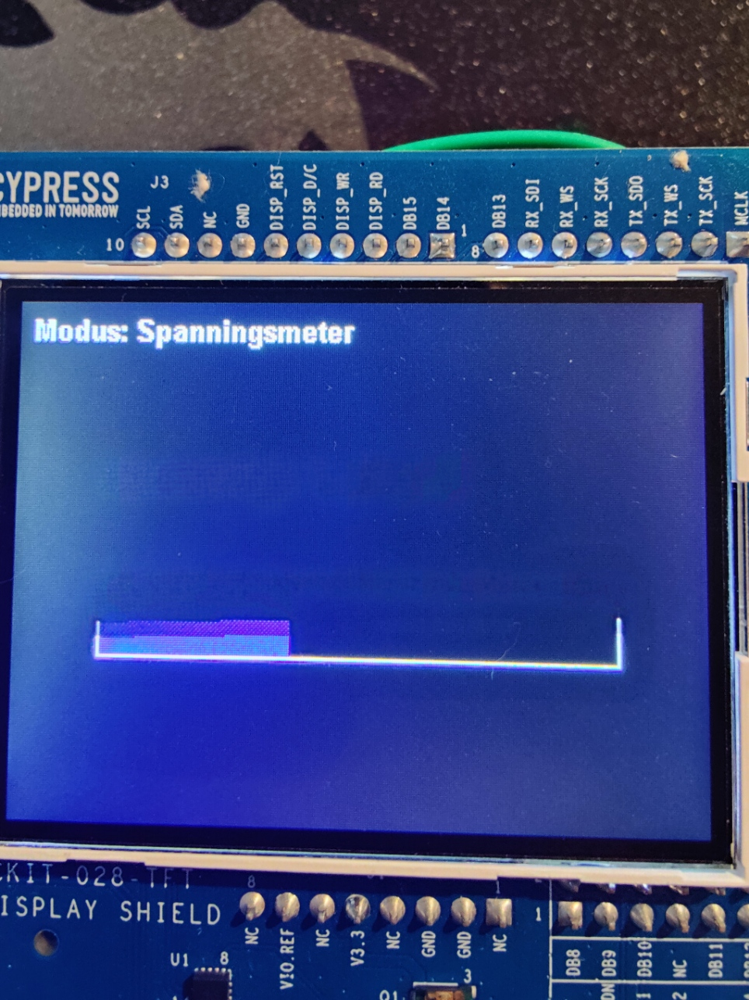
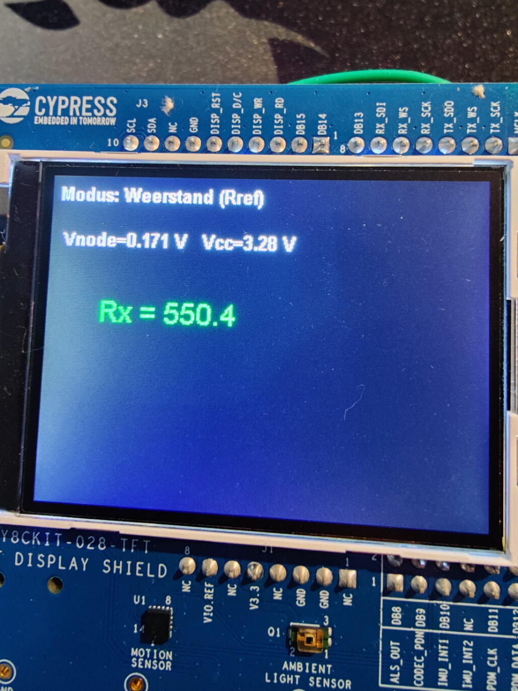
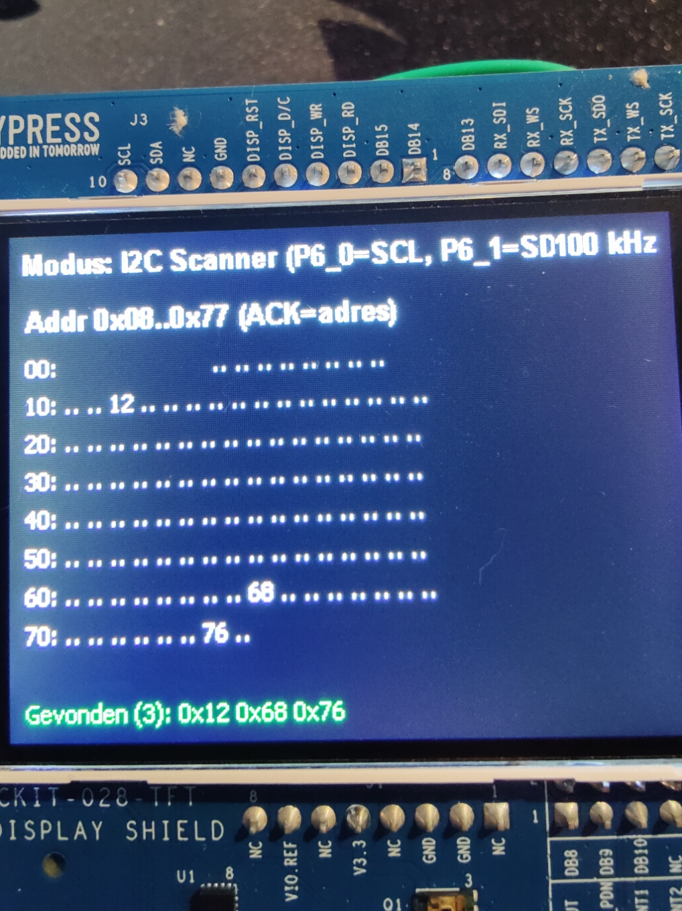
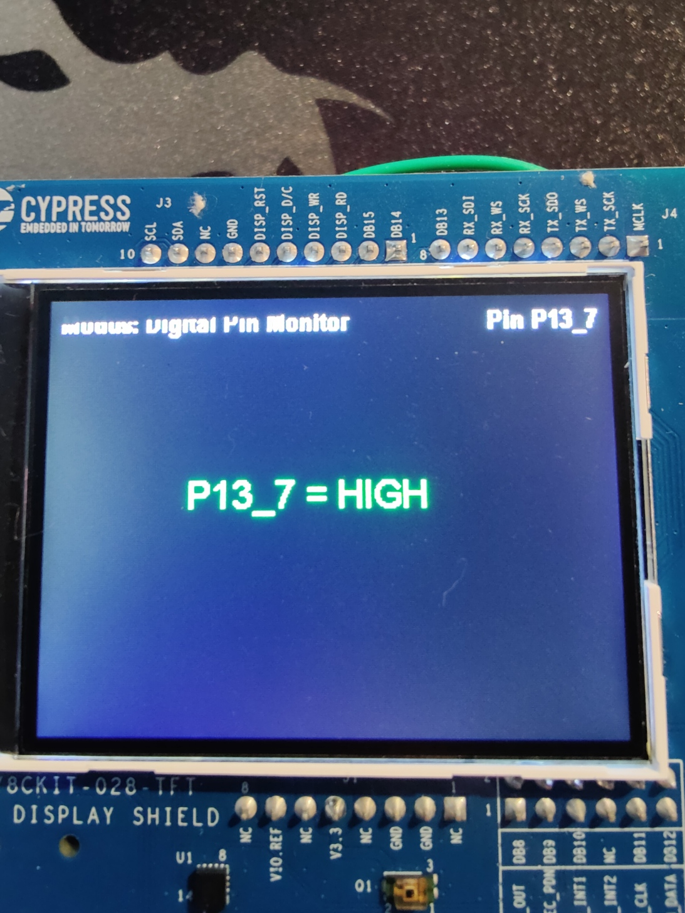

# Project_PEN2 – PSoC6 Multimeter & Oscilloscoop

Dit is een **ModusToolbox-project** voor de **CY8CKIT-062-WiFi-BT (PSoC 6 Pioneer Kit)** met het geïntegreerde **TFT-shield**.  
De applicatie combineert een **multimeter** (spanning / weerstand / continuïteit), een **oscilloscoop**, een **I²C-scanner** en **digitale pin-tests**.

---

## Documentatie & structuur

- [Hardware documentatie](hardware/hardware.md) – uitleg van alle gebruikte componenten (BMP280, Rref, potmeter, TFT, etc.) met foto’s.  
- [Software code-overview](software/CODE_OVERVIEW.md) – detailuitleg van de code (`tft_task.c`, FreeRTOS, emWin, pinnen en functionaliteiten).  
- [Pictures map](pictures/) – screenshots/foto's per modus (gelinkt hieronder).

---

## Functionaliteiten & modi

| # | Modus | Beschrijving | Screenshot |
|---|-------|--------------|------------|
| 1 | Oscilloscoop | Grafiek van ADC-samples, T/div instelbaar via lange druk. | [](pictures/modus_osci.png) |
| 2 | PWM-scope (extern) | Meet f, duty, Vpp, Vhigh van externe PWM op P10_0. | [](pictures/modus_pwm_scope.png) |
| 3 | Spanningsmeter | 0–3.3 V, gemiddelde van 10 samples, met bar-graph. | [](pictures/modus_vmeter.png) |
| 4 | Weerstandsmeter | Spanningsdeler met Rref=10kΩ, berekent Rx. | [](pictures/modus_weerstand.png) |
| 5 | Continuïteit | P10_6 met pull-up, toont “Contact” bij LOW. | [](pictures/modus_continu.png) |
| 6 | I²C-scanner | Scant 0x08..0x77 op P6_0/P6_1 @100 kHz. | [](pictures/modus_i2c_scan.png) |
| 7 | Digital Pin Tester | P13_6 toggelt elke 500ms en wordt teruggelezen. | [](pictures/modus_digpin_out.png) |
| 8 | Digital Pin Monitor | P13_7 als INPUT_PULLUP, toont live HIGH/LOW. | [](pictures/modus_digpin_in.png) |

---

## Downloads

- Voor de volledige projectbestanden:  
  Zie de **[Releases](https://github.com/RunarJans/Project_PEN2/releases)** pagina.  
  Daar vind je de **ZIP** van het complete ModusToolbox-project.

---

## Builden & flashen (ModusToolbox)

### IDE
1. Clone deze repo lokaal.  
2. Open in ModusToolbox: *File → Open Application* en selecteer de map.  
3. Build & Program naar **CY8CKIT-062-WiFi-BT**.

### CLI
```bash
make getlibs
make build
make program
```

---

## Veiligheid

- **Max 3.3 V** op de ADC-ingang (P10_0).  
- Altijd **GND↔GND** verbinden bij externe signalen (Pico / 2e PSoC).  
- Gebruik serieweerstanden voor LED-testen.

---

## Licentie

Kies en voeg een licentie toe (bijv. MIT of BSD-3-Clause).
