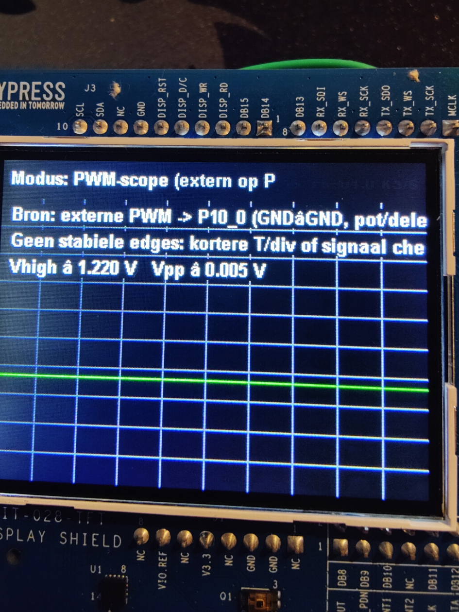
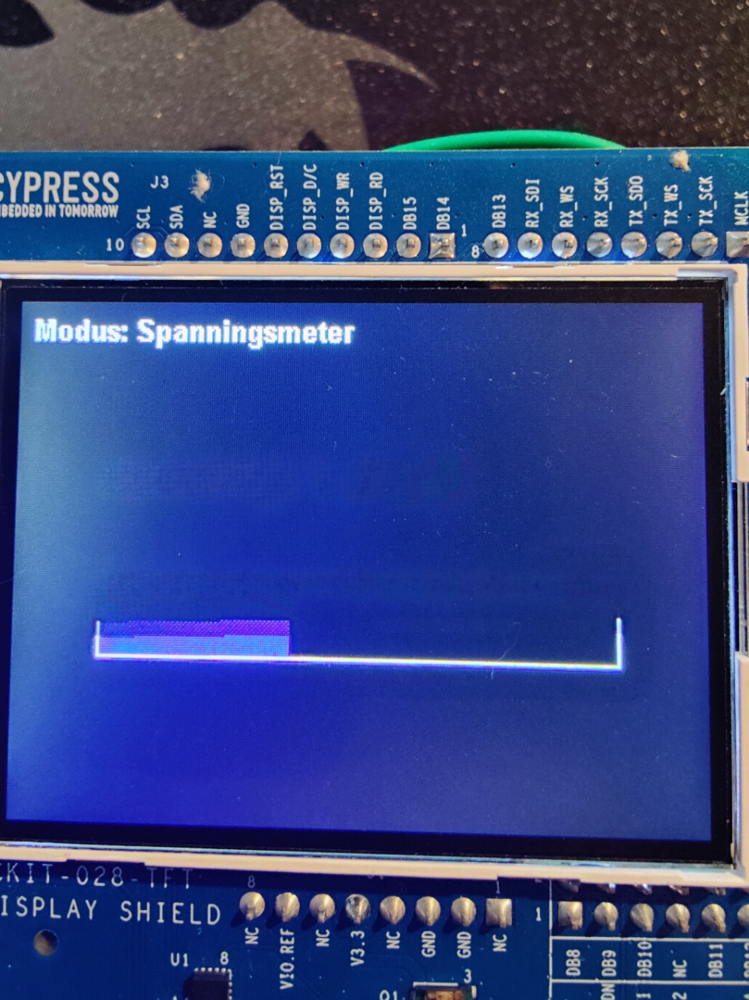
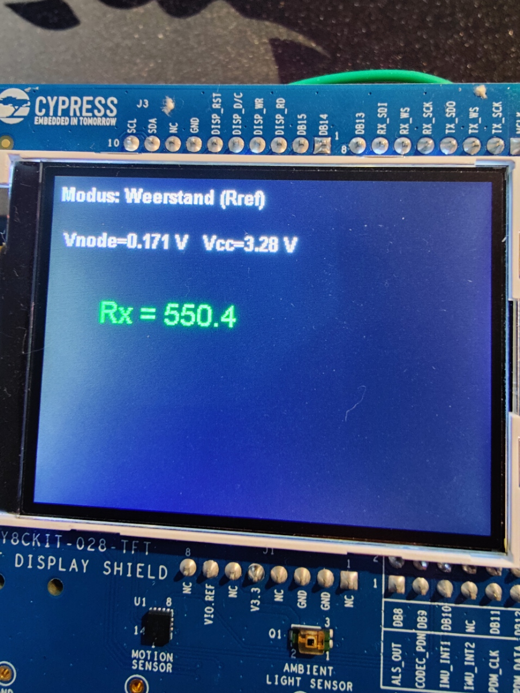
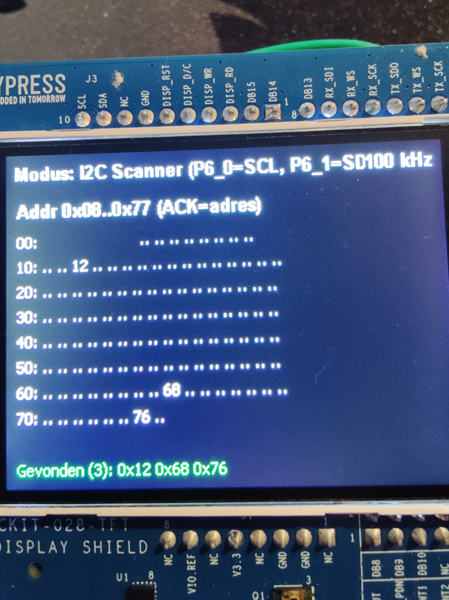
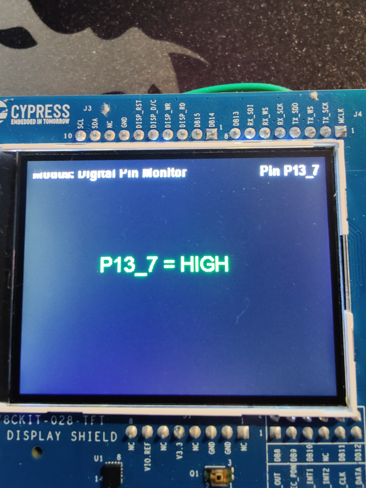

# Hardware-overzicht – PSoC6 Multimeter & Oscilloscoop

Dit document beschrijft alle gebruikte hardware, de rol in het project, relevante eigenschappen en **werkende links naar de afbeeldingen** in de map [`pictures/`](../pictures).

> Alle afbeeldingen hieronder verwijzen naar schermfoto’s van de bijhorende **modus** op het TFT, zodat je per onderdeel meteen ziet waar het voor gebruikt wordt.

---

## Inhoud
- [PSoC 6 Pioneer Kit (CY8CKIT-062-WiFi-BT)](#psoc-6-pioneer-kit-cy8ckit-062-wifi-bt)
- [ST7789V TFT-shield (emWin driver)](#st7789v-tft-shield-emwin-driver)
- [Potentiometer 1 kΩ (ADC-test/kalibratie)](#potentiometer-1-kω-adc-testkalibratie)
- [Referentieweerstand 10 kΩ (weerstandsmeter)](#referentieweerstand-10-kω-weerstandsmeter)
- [BMP280 druksensor (I²C)](#bmp280-druksensor-i²c)
- [LED + serieweerstand (Digital Pin Tester)](#led--serieweerstand-digital-pin-tester)
- [Breadboard & jumpers](#breadboard--jumpers)
- [Externe signaalbronnen (optioneel)](#externe-signaalbronnen-optioneel)
- [Gerelateerde documenten](#gerelateerde-documenten)

---

## PSoC 6 Pioneer Kit (CY8CKIT-062-WiFi-BT)

**Functie in project**  
- Hoofdcontroller: ADC-metingen, GPIO, I²C, GUI-rendering op TFT, FreeRTOS-taken.

**Belangrijkste eigenschappen**  
- Dual‑core PSoC 6, 12‑bit SAR‑ADC, GPIO met interne pull‑ups, I²C‑hardware.  
- Voeding 3.3 V logica – **max 3.3 V op ADC-ingang**.

---

## ST7789V TFT-shield (emWin driver)

**Functie in project**  
- Grafische output voor alle modi (oscilloscoop, voltmeter, weerstand, I²C‑scanner, digitale pin-tools).

**Belangrijkste eigenschappen**  
- 320×240 pixels; aangestuurd via `mtb_st7789v` + emWin (`GUI.h`).  
- Dubbele buffers zijn niet gebruikt; tekenen gebeurt per frame.

**Gerelateerde screenshot**  

---

## Potentiometer 1 kΩ (ADC-test/kalibratie)

**Functie in project**  
- Variabele spanning leveren op **P10_0** om voltmeter/oscilloscoop te testen en **ADC‑kalibratie** te bepalen (`ADC_MIN/MAX`, `V_MIN/MAX`).

**Eigenschappen & tips**  
- Lineaire potmeter; sluit wiper naar **P10_0**, uiteinden naar **3V3** en **GND**.  
- Houd totale bronimpedantie laag voor stabiele ADC‑lezing.

**Gerelateerde screenshot**  

---

## Referentieweerstand 10 kΩ (weerstandsmeter)

**Functie in project**  
- Vormt met onbekende **Rx** een spanningsdeler: `3V3 —[Rref]—●—[Rx]—GND`, meet in **●** op **P10_0**.  
- In code: `RREF_OHM` en `VCC_V` bepalen de nauwkeurigheid van de berekende **Rx**.

**Eigenschappen & tips**  
- Kies **nauwkeurige** 1 % of beter.  
- Beste meetbereik wanneer **Rx ≈ Rref**.

**Gerelateerde screenshot**  

---

## BMP280 druksensor (I²C)

**Functie in project**  
- Wordt gebruikt om de **I²C‑scanner** te testen; de scanner toont **0x76/0x77** als het device aanwezig is.

**Eigenschappen**  
- Werkt via **I²C** *en* **SPI** (als de pinnen/spi‑mode anders aangesloten worden).  
- Aanbevolen pull‑ups **4.7–10 kΩ** naar **3V3** op SCL/SDA.  
- Adres selecteerbaar (0x76/0x77) via SDO‑pin.

**Aansluitingen (voor I²C)**  
- SCL → **P6_0**, SDA → **P6_1**, VCC → 3V3, GND → GND.

**Gerelateerde screenshot**  

---

## LED + serieweerstand (Digital Pin Tester)

**Functie in project**  
- Visuele controle van **P13_6** (toggle‑output). De LED knippert met ~0,5 Hz.  
- Dezelfde pin wordt kort als **input** ingelezen om de status terug te koppelen.

**Aansluiten**  
- **P13_6 → LED → serieweerstand (330 Ω–1 kΩ) → GND**.

---

## Breadboard & jumpers

**Functie in project**  
- Snel prototypen: spanningsdeler voor weerstandsmeter, potmeter‑opstelling, verbindingen naar ADC/I²C/GPIO.

---

## Externe signaalbronnen (optioneel)

**Raspberry Pi Pico (Arduino IDE)**  
- Eenvoudige blokgolf op **GP2** (0,5 Hz of ~1 kHz).  
- Verbind **GP2 → P10_0** (PWM‑scope) of **GP2 → P13_7** (Digital Pin Monitor), **GND↔GND**.

**Tweede PSoC als PWM‑generator**  
- `cyhal_pwm_set_duty_cycle(&pwm, 50, 1000);` voor ~1 kHz op testpin.  
- Sluit aan op **P10_0** (ADC) of **P13_7** (digitale input).

Gerelateerde screenshots:  
- PWM‑scope:   
- Digitale monitor: 

---

## Gerelateerde documenten

- Code‑uitleg: [`../software/CODE_OVERVIEW.md`](../software/CODE_OVERVIEW.md)  
- Map met alle afbeeldingen: [`../pictures/`](../pictures)  
- Hoofd‑README (project): [`../README.md`](../README.md)
